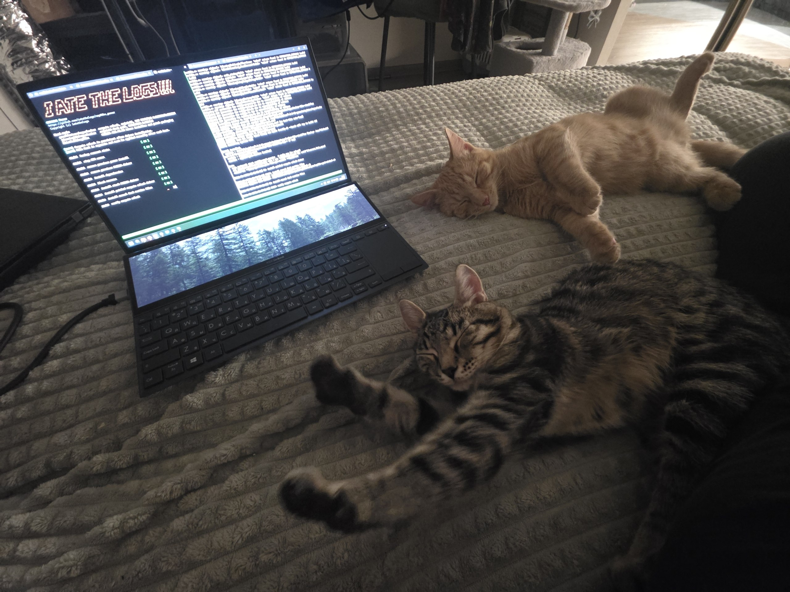
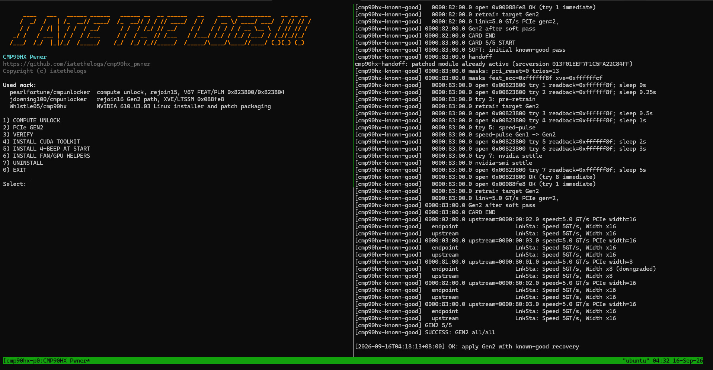
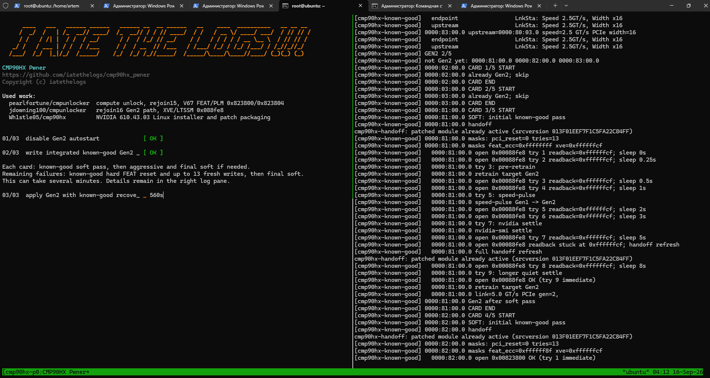

```text
  ____   __  __   ____     ___     ___    _   _  __  __
 / ___| |  \/  | |  _ \   / _ \   / _ \  | | | | \ \/ /
| |     | |\/| | | |_) | | (_) | | | | | | |_| |  \  /
| |___  | |  | | |  __/   \__, | | |_| | |  _  |  /  \
 \____| |_|  |_| |_|        /_/   \___/  |_| |_| /_/\_\

      ____   __        __  _   _   _____   ____
     |  _ \  \ \      / / | \ | | | ____| |  _ \
     | |_) |  \ \ /\ / /  |  \| | |  _|   | |_) |
     |  __/    \ V  V /   | |\  | | |___  |  _ <
     |_|        \_/\_/    |_| \_| |_____| |_| \_\

```

Инструмент для CMP 90HX с двумя независимыми действиями: установка compute unlock и ручное включение PCIe Gen2.

При обычном запуске `rejoin17.sh` сам открывает `tmux` и делит окно на две панели: слева интерфейс и прогресс, справа подробный живой лог команд.



## Главное меню

```text
1) COMPUTE UNLOCK
2) PCIe GEN2
3) VERIFY
4) INSTALL CUDA TOOLKIT
5) INSTALL 4-BEEP AT START
6) INSTALL FAN/GPU HELPERS
7) UNINSTALL
0) EXIT
```



### COMPUTE UNLOCK

Устанавливает NVIDIA 610.43.03, активирует патченный драйвер и проверяет снятие вычислительных ограничений.

После перезагрузки `cmp90hx-compute.service` выполняет только существующую инициализацию драйвера: штатный → патченный. Это необходимо, поскольку установленный драйвер блокирует автоматическую загрузку NVIDIA через udev. 


### PCIe GEN2

1. Каждая карта последовательно проходит мягкий этап known-good. Если он не помог — агрессивный этап и обязательный заключительный мягкий этап для этой же карты.
2. После обхода всех карт состояние проверяется заново. Только оставшиеся без Gen2 карты с закрытой FEAT получают исходное hard-FEAT восстановление: выгрузка NVIDIA → сброс выбранной карты → rescan → handoff → повторные реальные записи FEAT с проверкой и retrain.
3. После восстановления выполняется заключительный мягкий этап для той же карты, включая обработку XVE. Открытый FEAT исключает повторный hard-FEAT сброс.
4. Итоговая проверка охватывает весь первоначальный список карт: исчезновение устройства не считается успехом.

При неудаче программа предлагает перезагрузить сервер и повторить запуск: состояние карт после загрузки влияет на результат - и я не знаю, почему - разобраться за несколько суток непрерывной работы у меня так и не получилось.

## Установка

На чистой Ubuntu Secure Boot должен быть выключен. Во время установки не подключайте монитор к серверу: `nouveau` может занять карту до установки нужного драйвера.

Скачайте один скрипт:

```bash
wget https://raw.githubusercontent.com/iatethelogs/cmp90hx_pwner/main/rejoin17.sh
chmod +x rejoin17.sh
sudo AUTO_REBOOT_IF_NOUVEAU=1 ./rejoin17.sh
```

Сначала один раз выберите:

```text
1) COMPUTE UNLOCK
```

После успешной установки запускайте:

```text
2) PCIe GEN2
```



После каждой следующей перезагрузки повторно запускайте только `PCIe GEN2` - но учитывая вариативность запуска, чтобы избежать долгого ожидания, я рекомендую не перезагружать сервер а просто уводить карты в P8.


## VERIFY

Проверяет отдельно существующий compute unlock и текущее состояние PCIe link. Проверка ничего не применяет и не включает Gen2.

## Дополнительные пункты

`INSTALL CUDA TOOLKIT` — устанавливает CUDA Toolkit без замены выбранного драйвера.

`INSTALL 4-BEEP AT START` — ставит четыре коротких сигнала PC speaker при старте - лично для меня очень удобно, чтобы отслеживать когда можно подключаться по SSH.

`INSTALL FAN/GPU HELPERS` — устанавливает команды:

```text
fan-100 - Выкручивает кулеры всех карт на 100
fan-60 - Выкручивает кулеры всех карт на 60
fan-auto - Возвращает картам автоматический режим охлаждения
gpu-full - перевод карты в P0 путем записи частот
gpu-idle - Перевод карты в P8 путем записи частот
```

`UNINSTALL` — удаляет runtime проекта, драйверные файлы и дополнительные helper-команды.

## Использованные работы

- `pearlfortune/cmpunlocker` — compute unlock, rejoin15, V67 FEAT/PLM `0x823800/0x823804`.
- `jdowning100/cmpunlocker` — rejoin16 / PCIe path, XVE/LTSSM `0x088fe8`.
- `Wh1stle05/cmp90hx` — NVIDIA 610.43.03 Linux installer и packaging патчей.

## Warning

Это низкоуровневый экспериментальный проект для CMP 90HX. Он заменяет NVIDIA kernel modules и меняет состояние PCIe/GPU во время ручного Gen2-прохода. Используйте на свой риск.

