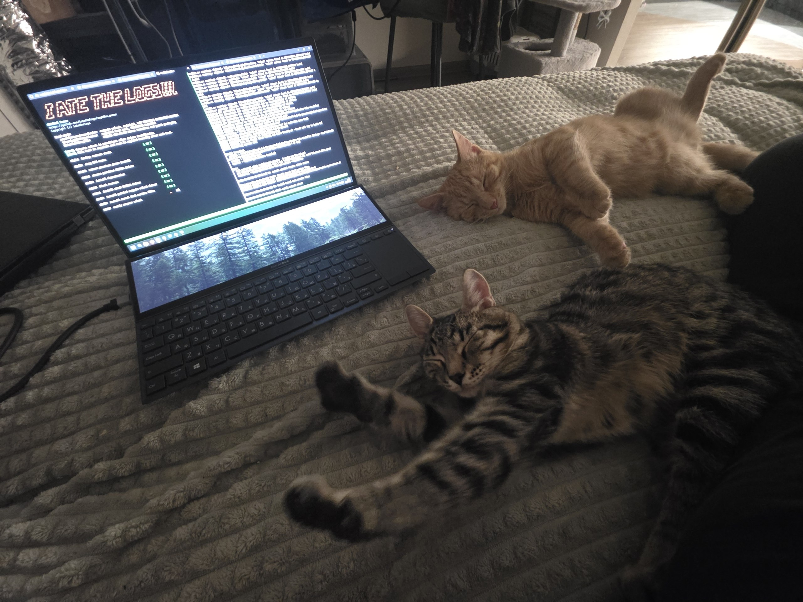
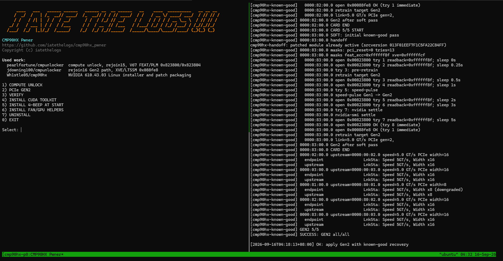
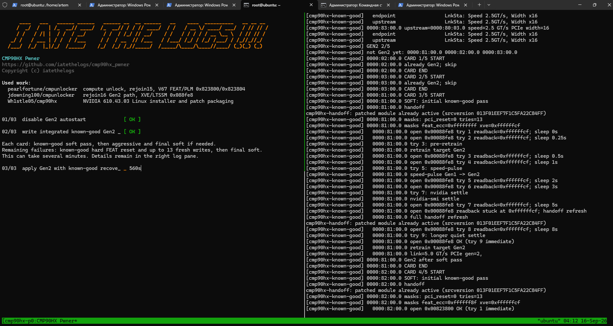

```text
  ____   __  __   ____     ___     ___    _   _  __  __
 / ___| |  \/  | |  _ \   / _ \   / _ \  | | | | \ \/ /
| |     | |\/| | | |_) | | (_) | | | | | | |_| |  \  /
| |___  | |  | | |  __/   \__, | | |_| | |  _  |  /  \
 \____| |_|  |_| |_|        /_/   \___/  |_| |_| /_/\_\

      ____   __        __  _   _   _____   ____
     |  _ \  \ \      / / | \ | | | ____| |  _ \
     | |_) |  \ \ /\ / /  |  \| | |  _|   | |_) |
     |  __/    \ V  V /   | |\  | | |___  |  _ <
     |_|        \_/\_/    |_| \_| |_____| |_| \_\

```

Инструмент для CMP 90HX с независимыми действиями: установка compute unlock, ручное включение PCIe Gen2 и ручное включение P2P.

## Совместимость

- NVIDIA CMP 90HX (`10de:220d`)
- Ubuntu 20.04 / 22.04 / 24.04
- Debian 11 / 12
- NVIDIA driver 610.43.03
- Secure Boot должен быть отключен



## Главное меню

```text
1) COMPUTE UNLOCK
2) PCIe GEN2
3) ENABLE P2P
4) VERIFY
5) INSTALL CUDA TOOLKIT
6) INSTALL 4-BEEP AT START
7) INSTALL FAN/GPU HELPERS
8) UNINSTALL
0) EXIT
```



### COMPUTE UNLOCK

Устанавливает NVIDIA 610.43.03, активирует патченный драйвер и проверяет снятие вычислительных ограничений.

При первом запуске скрипт блокирует `nouveau`. Если `nouveau` уже был загружен и не смог выгрузиться, Compute Unlock может завершиться сообщением:

`nouveau is still loaded. Reboot once, then run installer again.`

Это ожидаемое поведение. Перезагрузите сервер, снова запустите `cmp90hxpwner.sh` и повторите `COMPUTE UNLOCK`. После перезагрузки блокировка `nouveau` уже будет действовать.


### PCIe GEN2

Последовательно обрабатывает обнаруженные CMP 90HX, пытается включить PCIe Gen2 и после завершения проверяет фактическое состояние PCIe link.

Не пугайтесь, если отдельные попытки во время прохода завершаются `FAIL`. Скрипт использует несколько способов включения Gen2 для каждой карты, поэтому промежуточная неудача сама по себе не означает, что итоговый проход не сработает.

Не ориентируйтесь на промежуточный результат. Даже если после первого прохода, например, 4 из 5 карт уже работают в Gen2, работа ещё не закончена: скрипт выполнит дополнительные проходы для оставшихся карт и затем повторно проверит весь набор GPU.

Не прерывайте программу после первых успешных карт. Дождитесь полного завершения всех проходов и именно итогового результата в логе:

`SUCCESS: GEN2 all/all`

или окончательного сообщения о неудаче.

На системе с несколькими CMP 90HX полный процесс может занимать около 20–30 минут.

Если после полного прохода Gen2 включился не на всех картах, перезагрузите сервер и повторите `PCIe GEN2`. Состояние карт после загрузки может отличаться, поэтому иногда может потребоваться несколько циклов перезагрузки и повторного запуска.

Если появляются явно нетипичные ошибки, карты пропадают из системы или повторные запуски начинают вести себя некорректно, полностью выключите и обесточьте сервер на несколько минут. Это позволяет полностью сбросить состояние GPU. После этого включите сервер и попробуйте снова.

После того как Compute Unlock и Gen2 стабильно работают, я не рекомендую выключать или перезагружать сервер без необходимости. Compute Unlock сохраняется, но PCIe Gen2 после каждой загрузки нужно включать заново.

### ENABLE P2P

Включает peer-to-peer обмен между CMP 90HX для текущей сессии драйвера. P2P требует уже установленный Compute Unlock: пункт использует тот же патченный `nvidia.ko`, но перезагружает его один раз с параметрами P2P и выставляет IOMMU groups в `identity`.

P2P не прописывается в автозапуск и не меняет обычный compute handoff. После перезагрузки, перезапуска compute service или выгрузки драйвера P2P нужно включать заново через `ENABLE P2P`.

Рекомендуемый порядок:

```text
1) COMPUTE UNLOCK - выполнить один раз
2) PCIe GEN2 - включить Gen2 после загрузки сервера
3) ENABLE P2P - включить P2P после успешного Gen2
4) VERIFY - проверить compute unlock, P2P status и PCIe link
```

Gen2 не является строгим условием для самой кнопки P2P, но для производительности лучше сначала включить Gen2, а уже затем P2P. На проверенной паре CMP 90HX `0000:02:00.0 -> 0000:03:00.0` и обратно был получен реальный peer copy около `6.70 GB/s` при `buffer size: 256 MiB, iterations: 32` на PCIe Gen2.

Для ручной проверки можно использовать:

```bash
sudo ./cmp90hxpwner.sh --p2p-enable
sudo ./cmp90hxpwner.sh --p2p-status
nvidia-smi topo -p2p r
nvidia-smi topo -p2p w
```

## Установка

Проект рассчитан на headless-сервер. Монитор к серверу подключать не рекомендуется вообще: установка, Compute Unlock, PCIe Gen2 и P2P предполагают работу по SSH. Подключённый дисплей может привести к загрузке `nouveau` и занятию CMP 90HX до того, как будет установлен нужный драйвер.

Secure Boot должен быть выключен.

Скачайте и запустите скрипт:

```bash
curl -LO https://raw.githubusercontent.com/iatethelogs/cmp90hx_pwner/main/cmp90hxpwner.sh
chmod +x cmp90hxpwner.sh
sudo ./cmp90hxpwner.sh
```

Далее:

```text
1) COMPUTE UNLOCK - выполнить один раз
2) PCIe GEN2 - включить Gen2
3) ENABLE P2P - включить P2P для текущей сессии драйвера
4) VERIFY - проверить Compute Unlock, P2P status и PCIe link
```



## После перезагрузки

Compute Unlock сохраняется и активируется автоматически.

PCIe Gen2 не сохраняется - после каждой перезагрузки его нужно включать повторно через `PCIe GEN2`.

P2P тоже не сохраняется - после каждой перезагрузки или перезагрузки NVIDIA-драйвера его нужно включать повторно через `ENABLE P2P`.

Если сервер перезагружать не требуется, для простоя карт можно использовать `gpu-idle`, а перед нагрузкой - `gpu-full`.

## VERIFY

Проверяет отдельно существующий compute unlock, текущее состояние P2P runtime и текущее состояние PCIe link. Проверка ничего не применяет, не включает Gen2 и не включает P2P.

## Дополнительные пункты

`INSTALL CUDA TOOLKIT` — устанавливает CUDA Toolkit без замены выбранного драйвера.

`INSTALL 4-BEEP AT START` — ставит четыре коротких сигнала PC speaker при старте - лично для меня очень удобно, чтобы отслеживать когда можно подключаться по SSH.

`INSTALL FAN/GPU HELPERS` — устанавливает команды:

```text
fan-100 - Выкручивает кулеры всех карт на 100
fan-60 - Выкручивает кулеры всех карт на 60
fan-auto - Возвращает картам автоматический режим охлаждения
gpu-full - Сбрасывает lock частоты ядра/памяти и фиксирует память на 9501 МГц для рабочего режима
gpu-idle - Сбрасывает lock частоты ядра и фиксирует память на 405 МГц; карта уходит в P8, ядро около 210 МГц
```

`UNINSTALL` — удаляет runtime проекта, драйверные файлы и дополнительные helper-команды.

## Использованные работы

- [pearlfortune/cmpunlocker](https://github.com/pearlfortune/cmpunlocker) - compute unlock, rejoin15, V67 FEAT/PLM `0x823800/0x823804`.
- [jdowning100/cmpunlocker](https://github.com/jdowning100/cmpunlocker) - rejoin16 / PCIe path, XVE/LTSSM `0x088fe8`.
- [Wh1stle05/cmp90hx](https://github.com/Wh1stle05/cmp90hx) - NVIDIA 610.43.03 Linux installer и packaging патчей.

## Warning

Это низкоуровневый экспериментальный проект для CMP 90HX. Он заменяет NVIDIA kernel modules и меняет состояние PCIe/GPU во время ручного Gen2-прохода и ручного P2P-включения. Используйте на свой риск.


---

# English

A tool for CMP 90HX with independent actions: applying the compute unlock, manually enabling PCIe Gen2, and manually enabling P2P.

## Compatibility

- NVIDIA CMP 90HX (`10de:220d`)
- Ubuntu 20.04 / 22.04 / 24.04
- Debian 11 / 12
- NVIDIA driver 610.43.03
- Secure Boot must be disabled


## Main menu

```text
1) COMPUTE UNLOCK
2) PCIe GEN2
3) ENABLE P2P
4) VERIFY
5) INSTALL CUDA TOOLKIT
6) INSTALL 4-BEEP AT START
7) INSTALL FAN/GPU HELPERS
8) UNINSTALL
0) EXIT
```


### COMPUTE UNLOCK

Installs NVIDIA 610.43.03, activates the patched driver, and verifies that the compute restrictions have been removed.

On the first run, the script blocks `nouveau`. If `nouveau` was already loaded and could not be unloaded, Compute Unlock may stop with:

`nouveau is still loaded. Reboot once, then run installer again.`

This is expected. Reboot the server, run `cmp90hxpwner.sh` again, and repeat `COMPUTE UNLOCK`. After the reboot, the `nouveau` blacklist will already be active.


### PCIe GEN2

Processes the detected CMP 90HX cards one by one, attempts to enable PCIe Gen2, and verifies the actual PCIe link state when finished.

Do not worry if some attempts end with `FAIL`. The script uses several methods to enable Gen2 on each card, so an intermediate failure does not necessarily mean that the final result will fail.

Do not judge the result from an intermediate pass. Even if, for example, 4 out of 5 cards are already running at Gen2 after the first pass, the process is not finished: the script will perform additional passes for the remaining cards and then verify the entire GPU set again.

Do not interrupt the program after the first successful cards. Wait for all passes to complete and for the final result in the log:

`SUCCESS: GEN2 all/all`

or the final failure message.

On a system with multiple CMP 90HX cards, the full process may take around 20–30 minutes.

If Gen2 is still not enabled on every card after a complete run, reboot the server and run `PCIe GEN2` again. GPU state can vary between boots, so several reboot-and-retry cycles may occasionally be required.

If you see clearly abnormal errors, cards disappear from the system, or repeated runs start behaving incorrectly, shut the server down completely and disconnect power for a few minutes. This allows the GPUs to fully reset. Then power the server back on and try again.

Once Compute Unlock and Gen2 are working reliably, I recommend avoiding unnecessary shutdowns or reboots. Compute Unlock persists, but PCIe Gen2 must be enabled again after every boot.

### ENABLE P2P

Enables peer-to-peer transfers between CMP 90HX cards for the current driver session. P2P requires Compute Unlock: this action uses the same patched `nvidia.ko`, but reloads it once with P2P parameters and switches the relevant IOMMU groups to `identity`.

P2P is not written to autostart and does not change the normal compute handoff. After a reboot, compute service restart, or NVIDIA driver unload/reload, enable P2P again through `ENABLE P2P`.

Recommended order:

```text
1) COMPUTE UNLOCK - run once
2) PCIe GEN2 - enable Gen2 after boot
3) ENABLE P2P - enable P2P after successful Gen2
4) VERIFY - check Compute Unlock, P2P status, and the PCIe link
```

Gen2 is not a strict requirement for pressing the P2P button, but for performance it is better to enable Gen2 first and P2P second. On a tested CMP 90HX pair, `0000:02:00.0 -> 0000:03:00.0` and the reverse direction reached a real peer copy result of about `6.70 GB/s` with `buffer size: 256 MiB, iterations: 32` on PCIe Gen2.

For manual checks:

```bash
sudo ./cmp90hxpwner.sh --p2p-enable
sudo ./cmp90hxpwner.sh --p2p-status
nvidia-smi topo -p2p r
nvidia-smi topo -p2p w
```

## Installation

This project is designed for headless servers. Avoid connecting a monitor to the server at all: installation, Compute Unlock, PCIe Gen2, and P2P are intended to be performed over SSH. A connected display may cause `nouveau` to load and claim the CMP 90HX before the required driver is installed.

Secure Boot must be disabled.

Download and run the script:

```bash
curl -LO https://raw.githubusercontent.com/iatethelogs/cmp90hx_pwner/main/cmp90hxpwner.sh
chmod +x cmp90hxpwner.sh
sudo ./cmp90hxpwner.sh
```

Then:

```text
1) COMPUTE UNLOCK - run once
2) PCIe GEN2 - enable Gen2
3) ENABLE P2P - enable P2P for the current driver session
4) VERIFY - check Compute Unlock, P2P status, and the PCIe link
```


## After reboot

Compute Unlock persists and is activated automatically.

PCIe Gen2 does not persist - after every reboot, enable it again through `PCIe GEN2`.

P2P also does not persist - after every reboot or NVIDIA driver reload, enable it again through `ENABLE P2P`.

If the server does not need to be rebooted, use `gpu-idle` while the cards are idle and `gpu-full` before starting a workload.

## VERIFY

Checks the existing compute unlock, the current P2P runtime status, and the current PCIe link state separately. Verification does not apply any changes and does not enable Gen2 or P2P.

## Additional options

`INSTALL CUDA TOOLKIT` - installs the CUDA Toolkit without replacing the selected driver.

`INSTALL 4-BEEP AT START` - installs four short PC speaker beeps during startup. I personally find this convenient for knowing when the server is ready for an SSH connection.

`INSTALL FAN/GPU HELPERS` - installs the following commands:

```text
fan-100 - Sets the fans on all cards to 100%
fan-60 - Sets the fans on all cards to 60%
fan-auto - Returns all cards to automatic fan control
gpu-full - Resets core/memory clock locks and fixes VRAM at 9501 MHz for the full-performance mode
gpu-idle - Resets the core clock lock and fixes VRAM at 405 MHz; the card drops to P8 with the core around 210 MHz
```

`UNINSTALL` - removes the project runtime, driver files, and additional helper commands.

## Referenced work

- [pearlfortune/cmpunlocker](https://github.com/pearlfortune/cmpunlocker) - compute unlock, rejoin15, V67 FEAT/PLM `0x823800/0x823804`.
- [jdowning100/cmpunlocker](https://github.com/jdowning100/cmpunlocker) - rejoin16 / PCIe path, XVE/LTSSM `0x088fe8`.
- [Wh1stle05/cmp90hx](https://github.com/Wh1stle05/cmp90hx) - NVIDIA 610.43.03 Linux installer and patch packaging.

## Warning

This is a low-level experimental project for the CMP 90HX. It replaces NVIDIA kernel modules and changes PCIe/GPU state during the manual Gen2 procedure and manual P2P enablement. Use it at your own risk.
